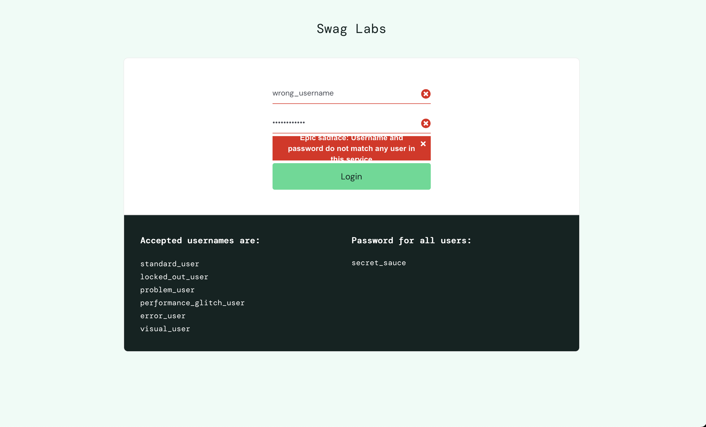
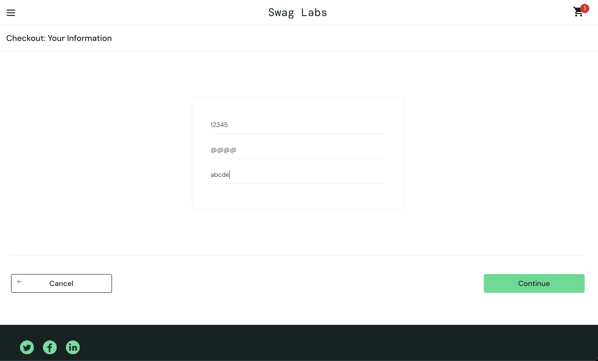
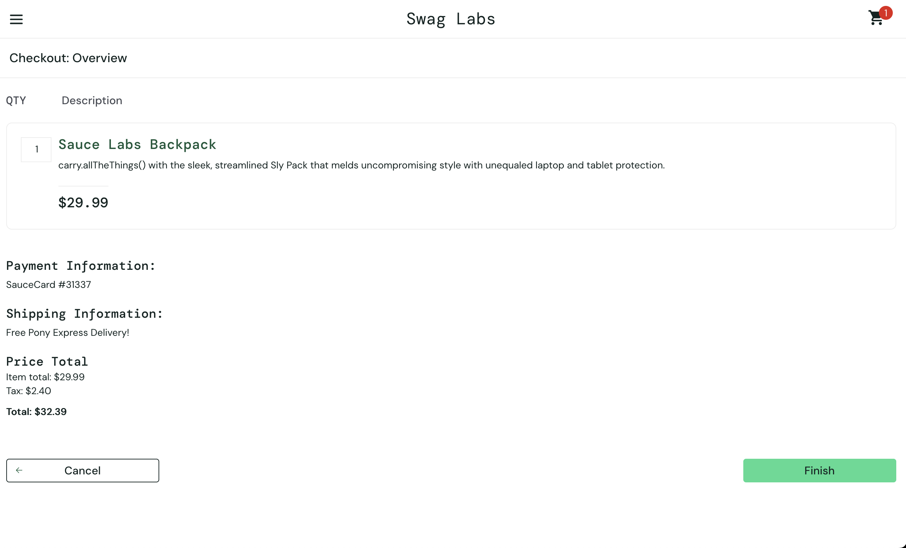

## BUG-01: Login error message is not user-friendly

- Steps:
  1. Открыть страницу логина
  2. Ввести неверный username или password
  3. Нажать Login

- Actual Result:
  Отображается сообщение: "Epic sadface: Username and password do not match any user in this service"

- Expected Result:
  Сообщение должно быть более простым и понятным для пользователя (например: "Invalid username or password")

- Type: UX Issue / Improvement
- Severity: Low
- Priority: Low

- Screenshot:
  

## BUG-02: Checkout form allows invalid data without validation

- Steps:
  1. Добавить товар в корзину
  2. Перейти в Checkout
  3. Ввести некорректные данные:
     - First Name: 12345
     - Last Name: @@@@
     - Zip Code: abcde
  4. Нажать Continue

- Actual Result:
  Система позволяет продолжить оформление заказа

- Expected Result:
  Поля должны валидироваться:
  - имя и фамилия должны содержать только буквы
  - zip code должен содержать только цифры
  - при ошибке должно отображаться сообщение

- Type: Functional Bug
- Severity: Medium
- Priority: Medium

- Screenshot:
  
  