# Test Cases - SauceDemo

---

### TC-01: Login with valid credentials

ID: TC-01
Title: Verify user login with valid credentials

Preconditions:

Login page is opened

Steps:

Enter username: standard_user
Enter password: secret_sauce
Click "Login"

Postconditions:

User is logged out

Expected Result:

User is redirected to the products page

Actual Result:

User successfully logged in and redirected

Status:

Passed

- Screenshot:
  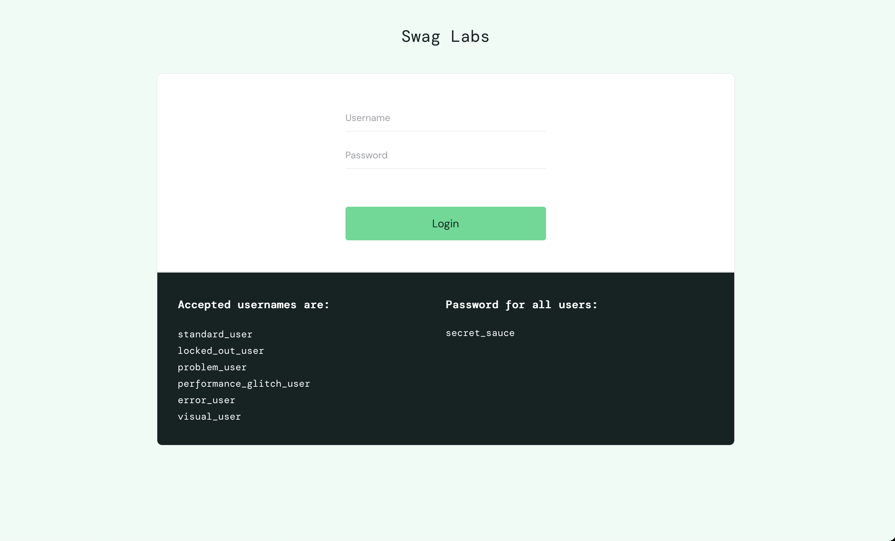
  
---

- Steps:
### TC-02: Login with invalid password

ID: TC-02
Title: Verify login with invalid credentials

Preconditions:

Login page is opened

Steps:

Enter username: wrong_username
Enter password: wrong_password
Click "Login"

Postconditions:

None

Expected Result:

Error message is displayed

Actual Result:

Error message displayed

Status:

Passed

- Screenshot:
  
---

### TC-03: Login with empty fields

ID: TC-03
Title: Verify login with empty fields

Preconditions:

Login page is opened

Steps:

Leave username empty
Leave password empty
Click "Login"

Postconditions:

None

Expected Result:

Validation error is displayed

Actual Result:

Error message displayed

Status:

Passed

- Screenshot:
  
---

### TC-04: Login with locked user

ID: TC-04
Title: Verify login with locked user

Preconditions:

Login page is opened

Steps:

Enter username: locked_out_user
Enter password: secret_sauce
Click "Login"

Postconditions:

None

Expected Result:

Error message about locked user

Actual Result:

Error message displayed

Status:

Passed

- Screenshot:
  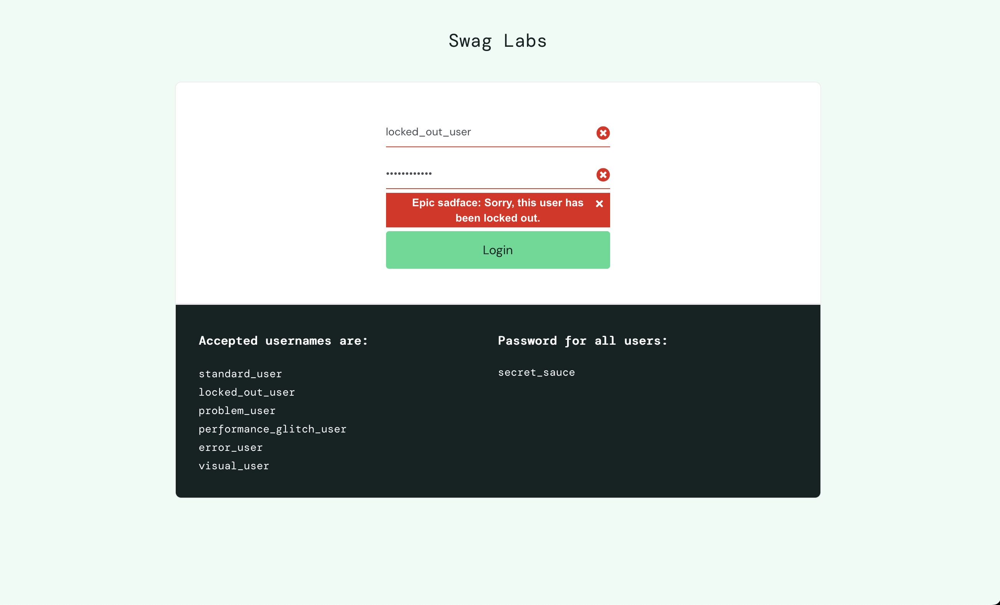
---

### TC-05: Logout functionality

ID: TC-05
Title: Verify logout functionality

Preconditions:

User is logged in

Steps:

Open menu
Click "Logout"

Postconditions:

User remains logged out

Expected Result:

User is redirected to login page

Actual Result:

User returned to login page

Status:

Passed

- Screenshot:
  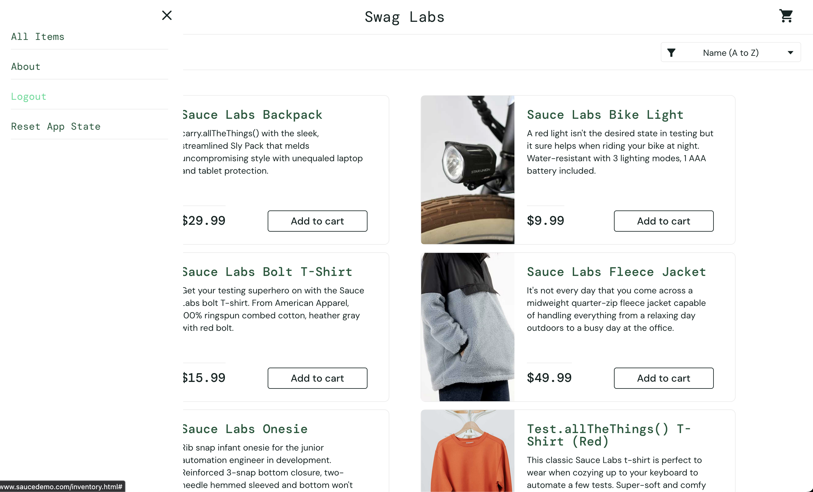
---

### TC-06: Add product to cart

ID: TC-06
Title: Verify adding product to cart

Preconditions:

User is logged in

Steps:

Click "Add to cart"

Postconditions:

Remove item from cart

Expected Result:

Button changes to "Remove"
Cart icon shows 1 item

Actual Result:

Product added successfully

Status:

Passed

- Screenshot:
  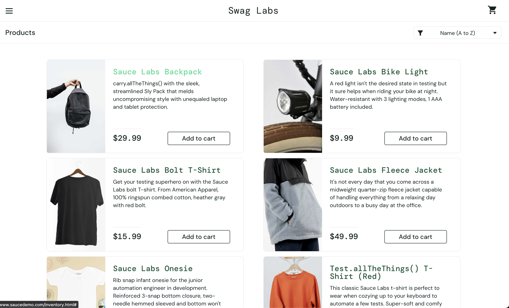
---

### TC-07: Remove product from cart

ID: TC-07
Title: Verify removing product from cart

Preconditions:

Product is added to cart

Steps:

Click "Remove"

Postconditions:

None

Expected Result:

Product removed from cart
Cart count updated

Actual Result:

Product removed successfully

Status:

Passed

- Screenshot:
  
  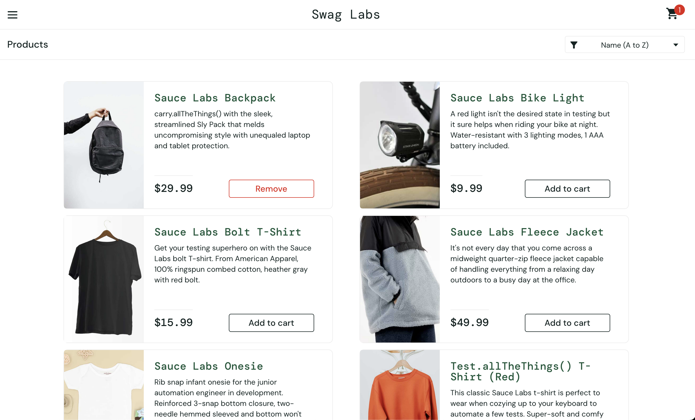
---

### TC-08: Open product details

ID: TC-08
Title: Verify opening product details

Preconditions:

User is logged in

Steps:

Click on product name

Postconditions:

Return to products page

Expected Result:

Product details page opens

Actual Result:

Product page displayed

Status:

Passed

- Screenshot:
  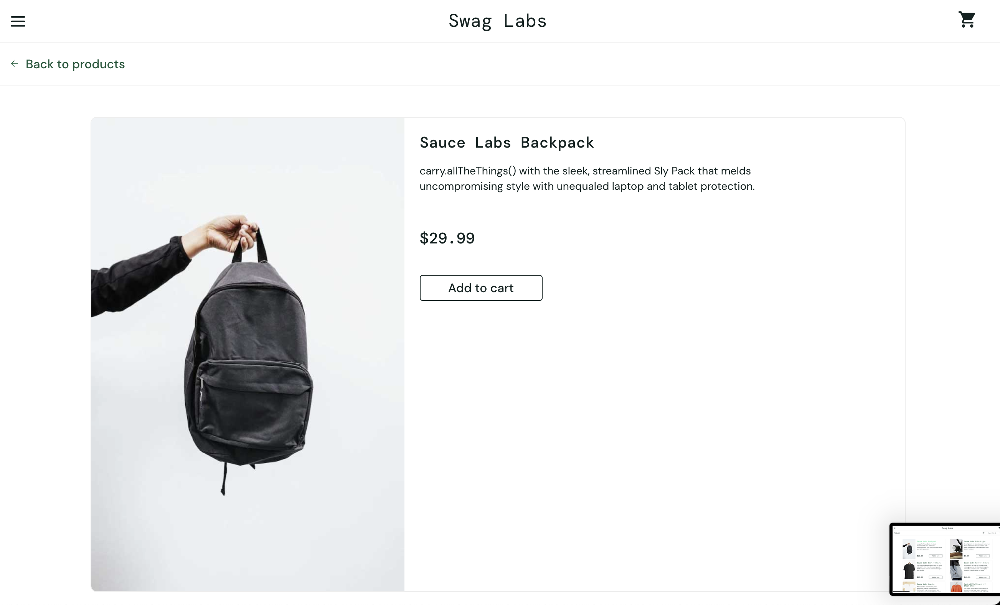
---

### TC-09: Sort products by price (low to high)

ID: TC-09
Title: Verify sorting products by price (low to high)

Preconditions:

User is on products page

Steps:

Select sorting option "Price (low to high)"

Postconditions:

None

Expected Result:

Products sorted by ascending price

Actual Result:

Sorting works correctly

Status:

Passed

- Screenshot:
  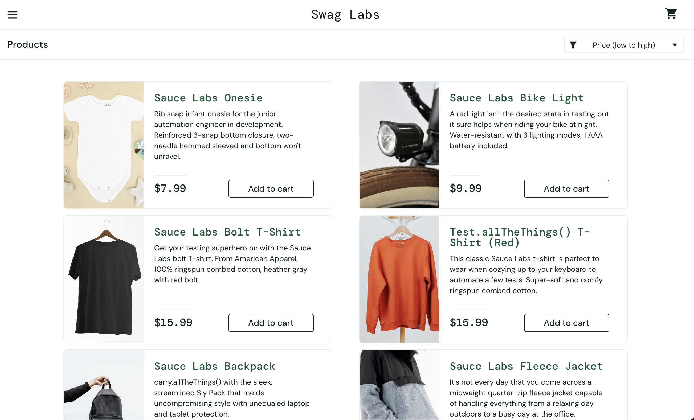
---

### TC-10: Add multiple products to cart

ID: TC-10
Title: Verify adding multiple products to cart

Preconditions:

User is logged in

Steps:

Add 1-2 products

Postconditions:

Remove products from cart

Expected Result:

Cart shows correct number of items

Actual Result:

Items added correctly

Status:

Passed

- Screenshot:
  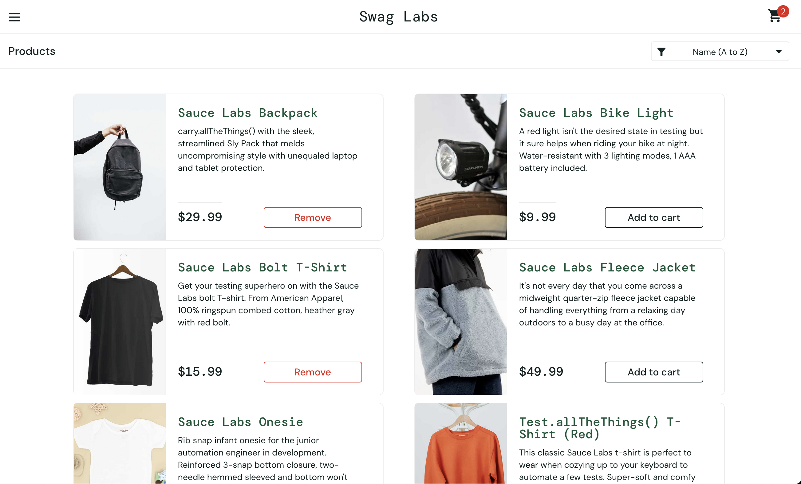
---

### TC-11: Open cart page

ID: TC-11
Title: Verify opening cart page

Preconditions:

User is logged in

Steps:

Click cart icon

Postconditions:

Return to products page

Expected Result:

Cart page is displayed

Actual Result:

Cart opened successfully

Status:

Passed

- Screenshot:
  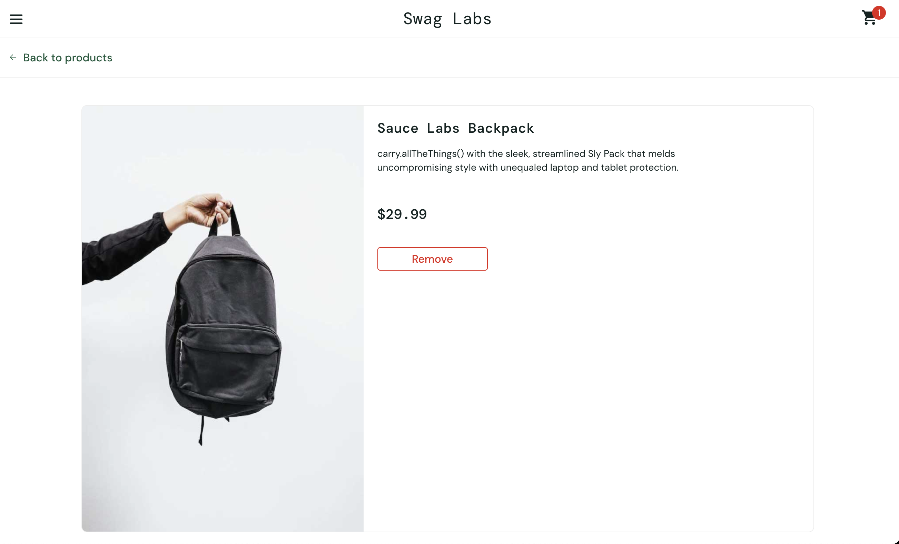
---

### TC-12: Continue shopping from cart

ID: TC-12
Title: Verify continue shopping from cart

Preconditions:

User is in cart

Steps:

Click "Continue Shopping"

Postconditions:

None

Expected Result:

User returns to products page

Actual Result:

Navigation works correctly

Status:

Passed

- Screenshot:
  
---

### TC-13: Checkout process (basic)

ID: TC-13
Title: Verify checkout process

Preconditions:

Product is in cart

Steps:

Click "Checkout"
Enter First Name
Enter Last Name
Enter Zip code
Click "Continue"

Postconditions:

Order not completed

Expected Result:

User proceeds to checkout overview

Actual Result:

Navigation successful

Status:

Passed

- Screenshot:
  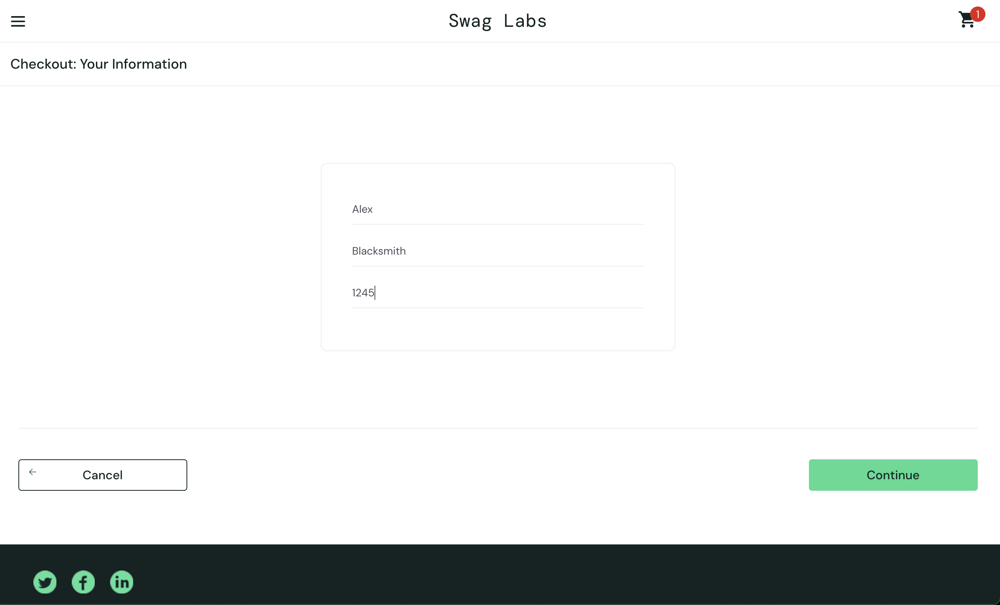
  
---

### TC-14: Checkout with empty fields

ID: TC-14
Title: Verify checkout with empty fields

Preconditions:

User is on checkout page

Steps:

Leave fields empty
Click "Continue"

Postconditions:

None

Expected Result:

Validation error displayed

Actual Result:

Error message shown

Status:

Passed

- Screenshot:
  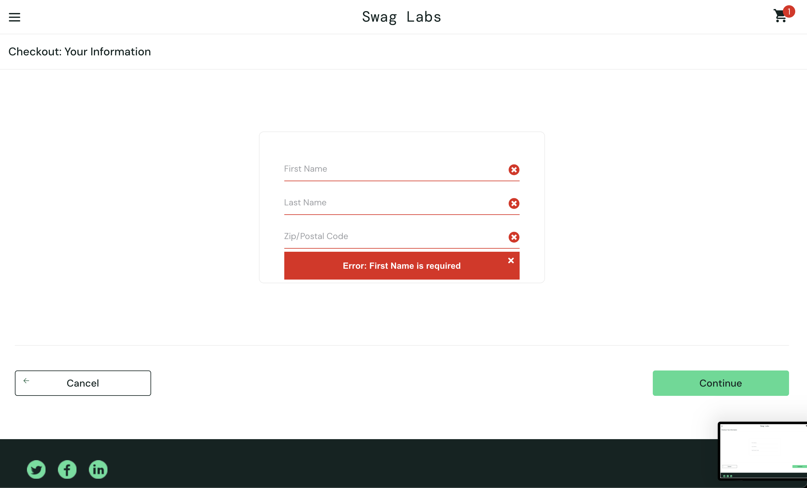
---

### TC-15: Finish order

ID: TC-15
Title: Verify order completion

Preconditions:

User is on checkout overview page

Steps:

Click "Finish"

Postconditions:

User returned to main page

Expected Result:

Order success message displayed

Actual Result:

Order completed successfully

Status:

Passed

- Screenshot:
  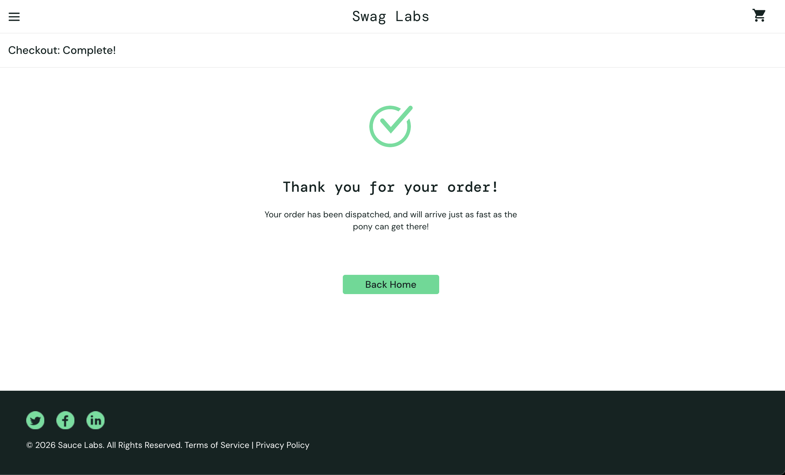